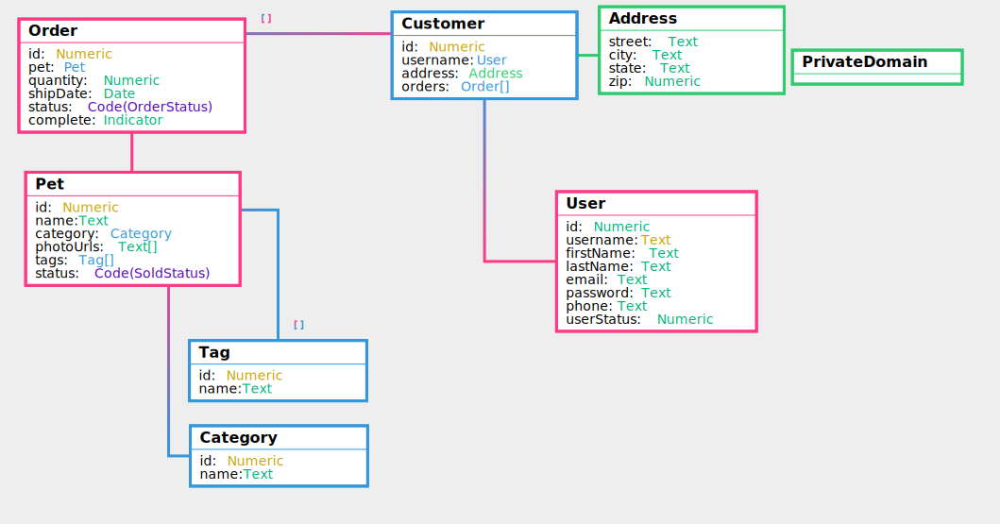

## Data Model of [jargon/SwaggerPetstore](/user/jargon/SwaggerPetstore/v/0.0.3)

## Data Definitions of [jargon/SwaggerPetstore](/user/jargon/SwaggerPetstore/v/0.0.3)

### Order

Property | Definition | Type
--- | --- | ---
id | A unique number assigned to every order | Numeric
pet | Informatio about the pet that is part of this order | [Pet](#pet)
quantity | A number specifying how many of the pet was purchased | Numeric
shipDate | The date that the order was shipped from the store | Date
status | Describes where the order is in it's fulfilment process. | Code (OrderStatus)
complete | Indicates if the order has finished | Indicator

### Customer

Property | Definition | Type
--- | --- | ---
id | A unique number that identifies a customer | Numeric
username | A unique name that users can choose to identify themselves to the store. | [User](#user)
address | The shipping address for the customer where they would like their orders delivered | [Address](#address)
orders | A list of orders this customer has made | [Order](#order)

### Address

Property | Definition | Type
--- | --- | ---
street | The street component of the address | Text
city | The city compomnent of the address | Text
state | The state component of the address | Text
zip | Zip or postal code for the address | Numeric

### Category

Property | Definition | Type
--- | --- | ---
id | A unique number that identifies a category | Numeric
name | The name of the category | Text

### User

Property | Definition | Type
--- | --- | ---
id | A unique number for the user | Numeric
username | The user's chosen username, which is unique across the store and identifies them | Text
firstName | The first, or given name of the user | Text
lastName | The last, or family name | Text
email | The email address of the user, used for electronic correspondance | Text
password | The passowrd of the user. Must be stored after encrypyion and salting | Text
phone | The users phone number | Text
userStatus | Status of the user | Numeric

### Tag

Property | Definition | Type
--- | --- | ---
id | A unique number that identifies this tag | Numeric
name | The name of this tag | Text

### Pet

Property | Definition | Type
--- | --- | ---
id | A unique number that identifies Pets | Numeric
name | The name of the pet | Text
category | The category that describes what this pet is | [Category](#category)
photoUrls | A list of urls of photos of this pet | Text
tags | A list of tags that describe this pet, like cute. | [Tag](#tag)
status | The staus of this pet, showing if it has been sold or not | Code (SoldStatus)

## Code Tables of [jargon/SwaggerPetstore](/user/jargon/SwaggerPetstore/v/0.0.3)

### OrderStatus

|Name | Description|
|--- | ---|
|placed | The Order has been placed|
|approved | The Order has been approved|
|delivered | the Order has been delivered|

### SoldStatus

|Name | Description|
|--- | ---|
|available | The Pet is available for sale|
|pending | The Pet has been sold, but the transaction is still pending|
|sold | The Pet has been sold|

## Open API Specification of [jargon/SwaggerPetstore](/user/jargon/SwaggerPetstore/v/0.0.3)

This specification is available in different forms:
- As a [JSON specification](jargon_SwaggerPetstore_openapi.json)
- As a [browsable Swagger Ui page](jargon_SwaggerPetstore_openapi.json)

